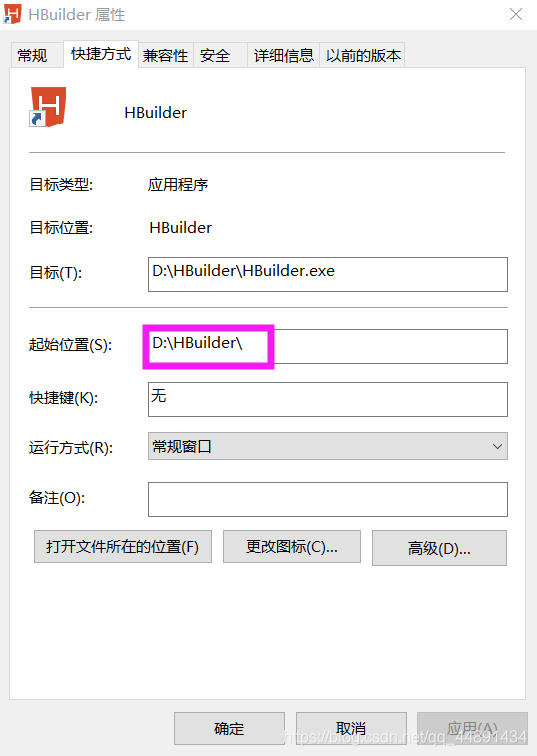
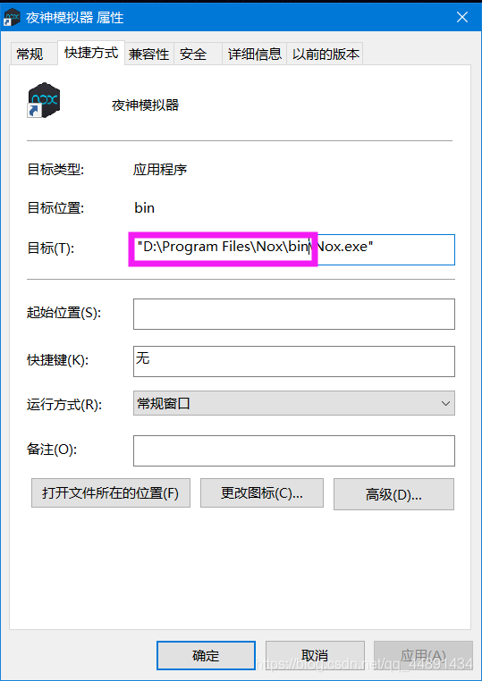

## Hbuilder和HbuilderX连接夜神模拟器（nox），调试程序
1. 鼠标**右击>属性**找到Hbuilder/hbuilderX的位置以及夜神（nox）位置，方法一样
2. 
3. 
4. 编写文件注意后缀名为<kbd>.bat</kbd>
	```
	d:
	cd  D:\Program Files\Nox\bin
	nox_adb  connect 127.0.0.1:62001
	nox_adb devicese
	d:
	cd  D:\HBuilder
	adb connect 127.0.0.1:62001
	adb devices
	```
5. 注意： ！！！
	+ 输入命令：netstat -ano，列出所有端口的情况！
	+ 输入命令：netstat -ano|findstr "端口号"！
	+ 不通过可以尝试另换端口，或者检查路径是否准确！