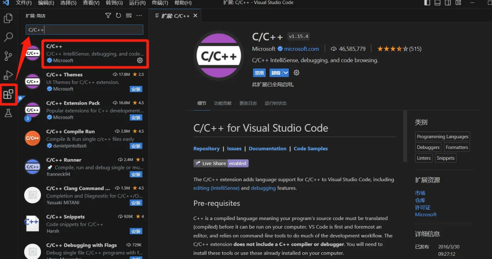
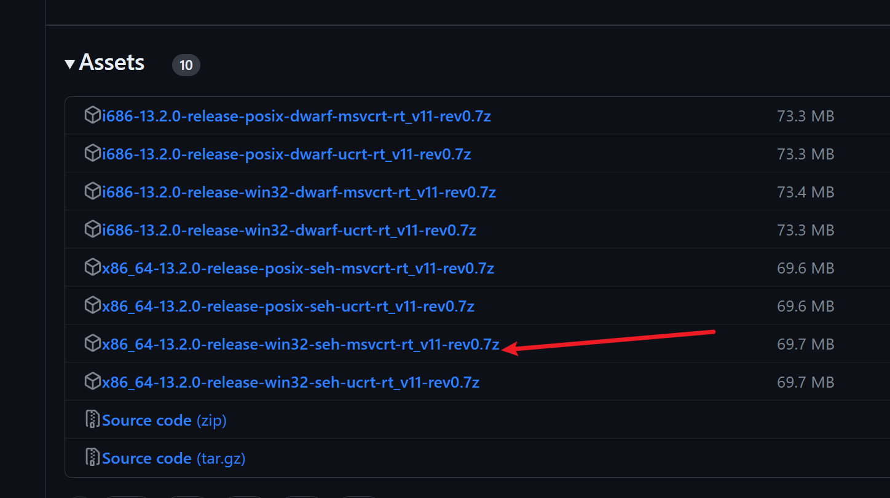
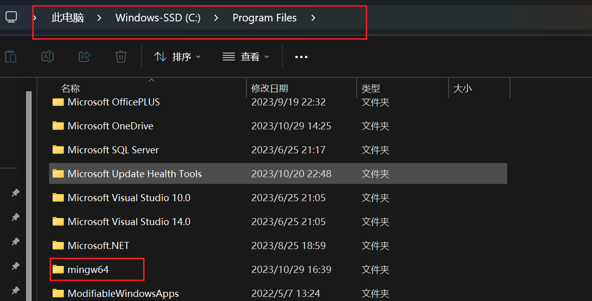
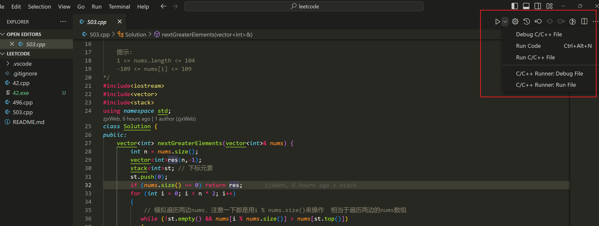

# VS Code 工具使用

> [VS Code下载](https://code.visualstudio.com/)

## VS Code 运行c++/C

### 1. 安装 C/C++ 语言插件

+ 在搜索框中搜索安装“C/C++”语言插件，注意代表官方的“Microsoft”标识
  
  + 

+ 通常，重要的插件在安装完后要**重启 VS Code** 才能生效，请注意按提示操作。
  
  > 本文所述的功能原则上只需要 "C/C++" 这一个插件，其他插件可能带来增强也可能带来干扰，请谨慎对待 (尤其是号称能一键运行 C/C++ 的插件)。

### 2. 获取 MinGW-w64 编译器软件包

> VS Code (搭配 "C/C++" 插件) 并不足以使 C/C++ 语言编写的代码能跑起来，甚至不是这项任务的核心。C、C++、Fortran 等编程语言属于**静态语言**。所谓静态语言，就是源代码需要

1. 先经过**编译**，构建出**可直接执行的程序文件**，

2. 再通过**启动这个可执行文件**来产生对应的效果。
+ C/C++ 语言的编译器有几大派系，不同操作系统流行使用的也有所不同，这里以比较有代表性的 GCC 为例。GCC 在 Windows 系统上的其中一个实现叫做 MinGW-w64，下载地址为
  
  ```url
  https://github.com/niXman/mingw-builds-binaries/releases
  # 此文件下载之后结尾是 .7z  解压可下载7z工具
  https://www.7-zip.org/download.html
  ```

+ 

+ 解压之后可以复制到c盘中
  
  + 

> 然后将此路径 `C:\Program Files\mingw64\bin` 添加到，系统环境变量中—— `path`


