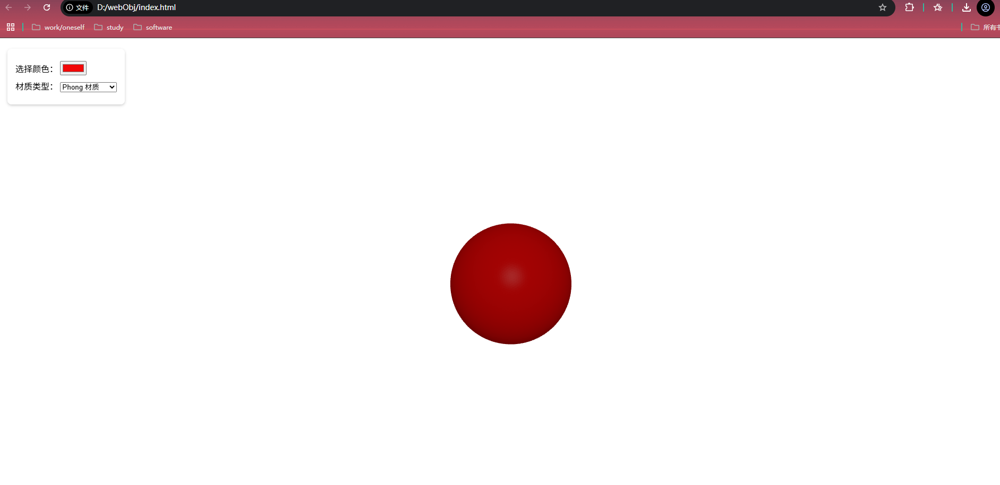
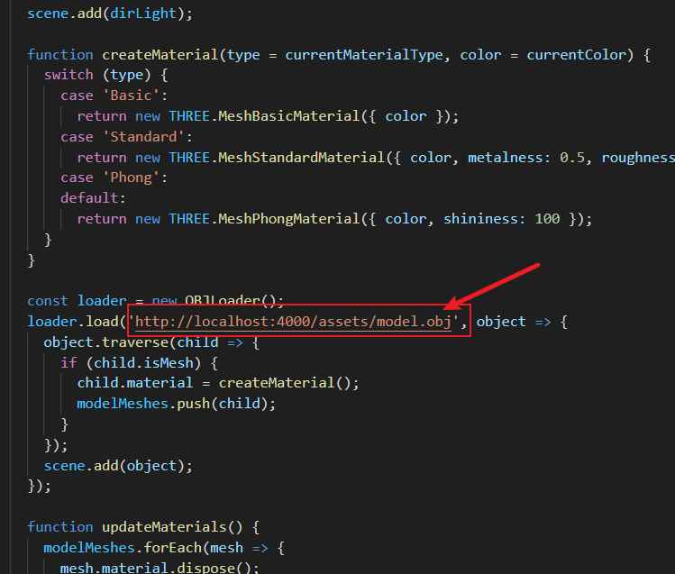

# web显示obj文件

[对应完整代码github仓库地址](https://github.com/zjxWeb/webObj-.git)

> 本项目是针对在web界面显示obj文件提供的解决方案，执行很简单；

## 执行流程

1. 首先clone本项目

2. 随后在项目根路径执行 `npm i`,安装对应的依赖文件；

3. 随后启动nodejs服务器，执行`node index.js`

4. 最后点击`index.html`就可以看到如下界面了

5. 如果要加载其它的模型，需要先将模型放入 `public` 文件夹中，重新启动nodejs服务器，随后更改 `index.html`中对应的地址，如 下图所示

